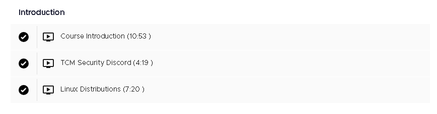
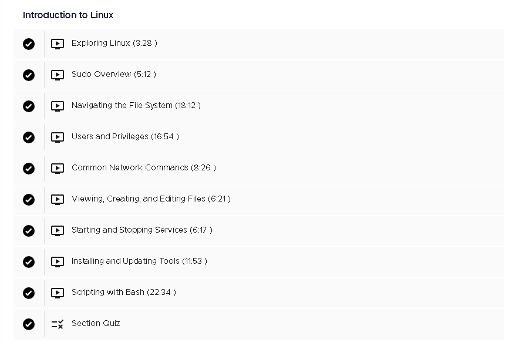
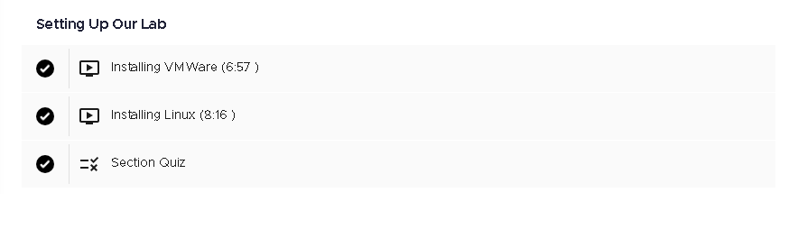

# 🐧 Linux 100 Fundamentals – TCM  

  
  
  
  
  

This repository contains **notes, labs, cheatsheets, case studies, and certificate of completion** for the *Linux 100 Fundamentals – TCM* program.  
The course provides a solid foundation in **Linux filesystem, permissions, processes, networking, scripting, and package management**.  

---

## 📚 Notes  

- 📄 [`01-introduction.md`](./notes/01-introduction.md) – Introduction to the course  
- 📄 [`02-filesystem-basics.md`](./notes/02-filesystem-basics.md) – Linux filesystem basics  
- 📄 [`03-file-operations.md`](./notes/03-file-operations.md) – File operations  
- 📄 [`04-users-permissions.md`](./notes/04-users-permissions.md) – Users & permissions  
- 📄 [`05-processes.md`](./notes/05-processes.md) – Process management  
- 📄 [`06-packages.md`](./notes/06-packages.md) – Package management  
- 📄 [`07-networking.md`](./notes/07-networking.md) – Networking fundamentals  
- 📄 [`08-scripting.md`](./notes/08-scripting.md) – Scripting basics  
- 📄 [`09-services-logs.md`](./notes/09-services-logs.md) – Services & logs  
- 📄 [`10-final-lab.md`](./notes/10-final-lab.md) – Final course lab  

---

## 🧪 Labs  

- 📑 [`01-filesystem-and-permissions.md`](./labs/01-filesystem-and-permissions.md) – Filesystem & permissions lab  
- 📑 [`02-package-and-process.md`](./labs/02-package-and-process.md) – Packages & processes lab  
- 📑 [`03-users-and-networking.md`](./labs/03-users-and-networking.md) – Users & networking lab  

---

## 📝 Cheatsheets  

- 📌 [`filesystem.md`](./cheatsheets/filesystem.md) – Filesystem commands  
- 📌 [`networking.md`](./cheatsheets/networking.md) – Networking essentials  
- 📌 [`processes.md`](./cheatsheets/processes.md) – Process management quick ref  
- 📌 [`users-and-permissions.md`](./cheatsheets/users-and-permissions.md) – Users & permissions cheatsheet  

---

## 🔬 Research & Extras  

- 📑 [`case-studies.md`](./extras/case-studies.md) – Case studies & scenarios  
- 📑 [`resources.md`](./extras/resources.md) – Additional resources  
- 📆 [`timeline.md`](./extras/timeline.md) – Timeline of Linux development & usage  

---

## 📖 Docs  

- 📘 [`CODE_OF_CONDUCT.md`](./CODE_OF_CONDUCT.md) – Contribution guidelines  
- 📘 [`LICENSE`](./LICENSE) – Project license  

---

## 📸 Screenshots  

| Step                  | Screenshot |
|-----------------------|------------|
| 🏫 Lesson Intro       |  |
| 🐧 Linux Basics       |  |
| 🔧 Lab Setup          |  |
| 📚 Lesson Conclusion  |  |

---

## 📜 Certificate  

🎓 [`Linux 100 Fundamentals – TCM`](./cert/certificate-linux-100-fundamentals-tcm.pdf)  

---

## 📝 Personal Review  

This course gave me a **practical foundation in Linux**.  
The **labs on filesystem, processes, and networking** helped me solidify command-line skills.  
I particularly appreciated the **services and scripting modules**, which are essential for system administration and security research.  

Overall, this program is a strong starting point for anyone aiming to **master Linux fundamentals**.  

---

## ✍️ Author  

**Thành Danh** – Red Team Learner & Security Researcher  

- GitHub: [@ngvuthdanhh](https://github.com/ngvuthdanhh)  
- Email: ngvu.thdanh@gmail.com   

---

## 📄 License  

This project is licensed under the terms of the **MIT License**.  
See [`LICENSE`](./LICENSE) for full details.  

© 2025 ngvuthdanhh. All rights reserved.  
